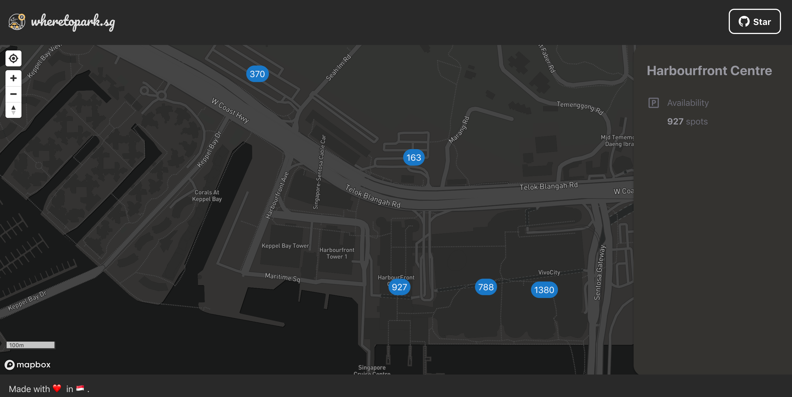

# Carpark Finder

[Carpark Finder](https://wheretopark.netlify.com/) is a simple web application aimed at creating a map-based tool for drivers in Singapore to find available parking lots easily.



## Technologies

- :atom_symbol: React (Front-End)
- [Netlify Functions](https://www.netlify.com/products/functions/) (Powered by AWS Lambda/ For backend tasks)
- [Mapbox](https://www.mapbox.com/) (3rd-Party Map Visualisation Service)
- [LTA DataMall API](https://www.mytransport.sg/content/mytransport/home/dataMall.html) (For real-time data on carpark availability)

## Features

- 📍 Find my location (This allows the user to pan and zoom the map to their current location to see the nearby carparks)
- 🅿️ Real-time parking availability data (Updated every 1 min)

## Development

To setup the app for development on your local machine, please follow the instructions below:

1. Clone the repo to your machine

```
git clone https://github.com/bilafish/carpark-finder.git
```

2. Install necessary npm packages

```
yarn install
```

3. Create a .env file in the root folder (Refer to [.env.sample](./.env.sample) as reference)
4. Start the development environment

```
yarn start
```
